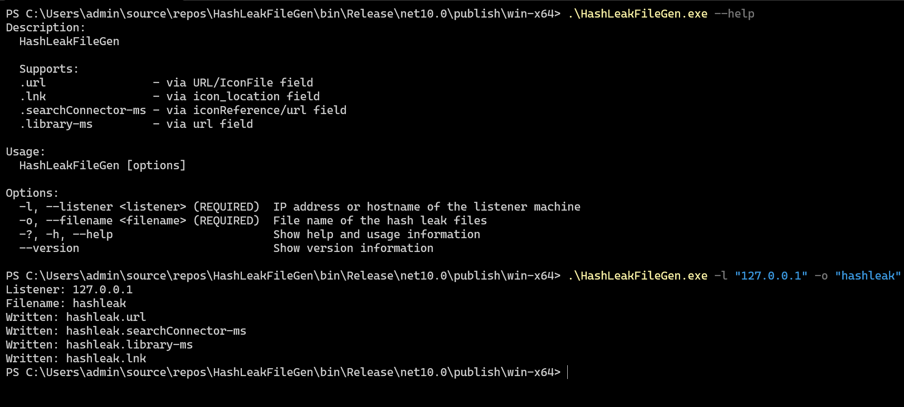

# HashLeakFileGen
```
Description:
  HashLeakFileGen

  Supports:
  .url                - via URL/IconFile field
  .lnk                - via icon_location field
  .searchConnector-ms - via iconReference/url field
  .library-ms         - via url field

Usage:
  HashLeakFileGen [options]

Options:
  -l, --listener <listener> (REQUIRED)  IP address or hostname of the listener machine
  -o, --filename <filename> (REQUIRED)  File name of the hash leak files
  -?, -h, --help                        Show help and usage information
  --version                             Show version information
```


